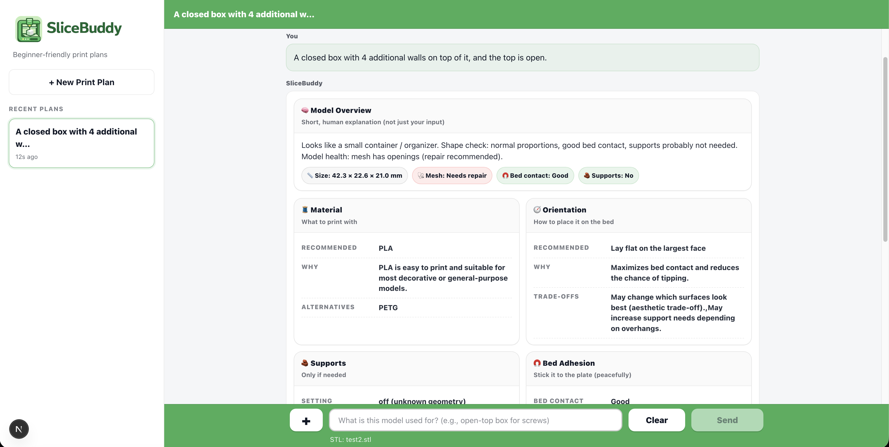
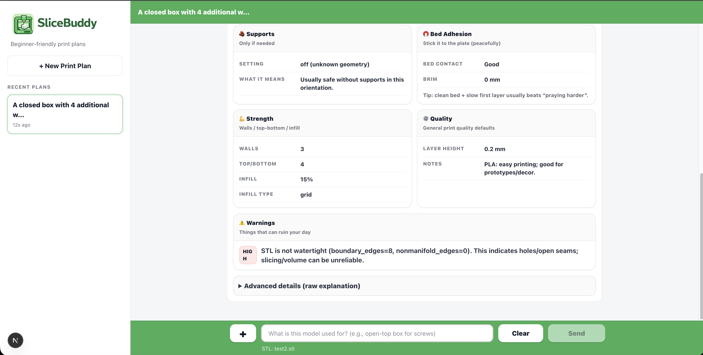
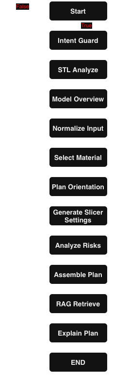

# 🧠 SliceBuddy

SliceBuddy is an agentic AI system for intelligent **3D print planning**.

It analyzes an STL file and usage description, then produces a structured, practical print plan — similar to how an experienced maker reasons before slicing a model.

SliceBuddy focuses on planning, not model generation.

---

## 🚀 Features

- STL geometry analysis (bounding box, contact area, overhangs, mesh health)
- Material recommendation (PLA / PETG / ABS / ASA / TPU)
- Orientation planning
- Slicer settings generation (walls, infill, supports, brim)
- Print risk detection with mitigations
- RAG knowledge grounding (Chroma + Markdown KB)
- FastAPI backend
- CLI interface
- Structured JSON output + human-readable explanation

---

## 🚀 UI


---

## 🧠 How It Works

SliceBuddy uses a deterministic multi-step workflow built with **LangGraph**.
---

## 🗺️ Workflow



Logic is rule-based where possible.  
The LLM is used only for explanation, not decision-making.

---

## 🏗 Architecture

### Core Stack

- Python 3.11+
- FastAPI
- LangGraph
- LangChain
- OpenAI
- ChromaDB (persistent local vector store)
- Trimesh (STL analysis)

---

## 📦 Project Structure

```
app/
  main.py                # FastAPI entrypoint

core/
  node/                  # LangGraph workflow nodes
  rag/                   # RAG + Chroma integration
  stl/                   # STL analysis engine

knowledge/
  3d_printing_knowledge_base.md

prompts/
  system/
  templates/

scripts/
  build_index.py
  stl_analyze.py
  stl_sanity.py

slicebuddy/
  cli.py

ui/
  # Next.js frontend
```

---

## 📊 STL Geometry Analysis

SliceBuddy extracts:

- Bounding box dimensions (X, Y, Z)
- Bed contact area
- Contact ratio (real vs bounding box)
- Aspect ratio
- Overhang percentage
- Maximum overhang angle
- Likely support requirement
- Mesh integrity:
  - Boundary edges
  - Non-manifold edges
  - Degenerate faces
  - Watertight check
  - Open-top detection

These signals drive planning decisions.

---

## 🖥 CLI Usage

```bash
python -m slicebuddy --stl path/to/model.stl --use "functional wall mount bracket"
```

Outputs:

- Material recommendation
- Orientation suggestion
- Support & brim guidance
- Strength settings
- Risk warnings

---

## 🌐 API Usage

Start the server:

```bash
uvicorn app.main:app --reload
```

Send a POST request to `/plan` with:

- `use` (form field)
- `stl` (file upload)

Example response:

```json
{
  "model_overview": "...",
  "plan": { ... },
  "warnings": [],
  "risks": { ... },
  "plan_explanation": "...",
  "stl_features": { ... }
}
```

---

## 🧠 RAG Knowledge System

Knowledge source:

```
knowledge/3d_printing_knowledge_base.md
```

Build the vector index:

```bash
python scripts/build_index.py
```

Chroma stores embeddings locally in:

```
.chroma/
```

---

## 🛠 Installation

Create a virtual environment:

```bash
python -m venv .venv
source .venv/bin/activate  # Mac/Linux
.venv\Scripts\activate   # Windows
```

Install dependencies:

```bash
pip install -r requirements.txt
```

Set your OpenAI key:

```bash
export OPENAI_API_KEY=your_key_here   # Mac/Linux
set OPENAI_API_KEY=your_key_here      # Windows
```

---

## 🎯 Design Principles

- Deterministic logic first
- LLM only for explanation
- Geometry-driven decisions
- No invented printer temperatures
- Beginner-friendly output
- Transparent reasoning

---

## ⚠ Disclaimer

SliceBuddy provides best-practice recommendations.

3D printing results depend on:

- Printer calibration
- Filament quality
- Environment
- Hardware limits

Always test critical prints.

---

## 📈 Roadmap

- Printer profile support
- Automatic orientation optimization
- Slicer preset export
- UI graph visualization
- Multi-material planning
